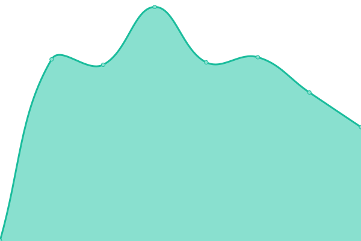
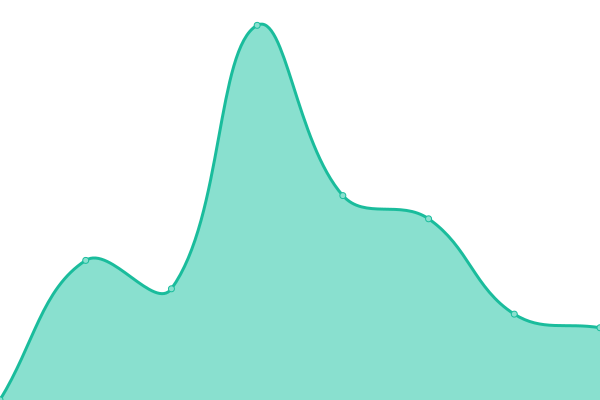
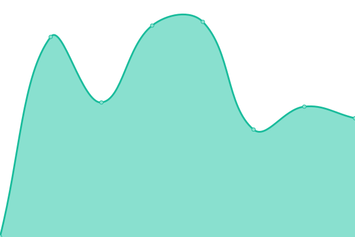

# [📈 Live Status](https://status.lucasmangroelal.nl): <!--live status--> **🟧 Partial outage**

This repository contains the open-source uptime monitor and status page for [Koen](https://status.lucasmangroelal.nl), powered by [Upptime](https://github.com/upptime/upptime).

With [Upptime](https://upptime.js.org), you can get your own unlimited and free uptime monitor and status page, powered entirely by a GitHub repository. We use [Issues](https://github.com/developerkoen/statuslm/issues) as incident reports, [Actions](https://github.com/developerkoen/statuslm/actions) as uptime monitors, and [Pages](https://status.lucasmangroelal.nl) for the status page.

<!--start: status pages-->
<!-- This summary is generated by Upptime (https://github.com/upptime/upptime) -->
<!-- Do not edit this manually, your changes will be overwritten -->
<!-- prettier-ignore -->
| URL | Status | History | Response Time | Uptime |
| --- | ------ | ------- | ------------- | ------ |
|  [Website 's Gravendreef College](https://www.sgdc.nl/) | 🟩 Up | [website-s-gravendreef-college.yml](https://github.com/developerkoen/statuslm/commits/HEAD/history/website-s-gravendreef-college.yml) | 

 1040ms
     
 | 

<a href="https://status.lucasmangroelal.nl/history/website-s-gravendreef-college">100.00%</a>
    

|  [Zermelo](https://sgdc.zportal.nl/) | 🟩 Up | [zermelo.yml](https://github.com/developerkoen/statuslm/commits/HEAD/history/zermelo.yml) | 

 541ms
     
 | 

<a href="https://status.lucasmangroelal.nl/history/zermelo">100.00%</a>
    

|  [Magister](https://sgravendreef.magister.net) | 🟩 Up | [magister.yml](https://github.com/developerkoen/statuslm/commits/HEAD/history/magister.yml) | 

 682ms
     
 | 

<a href="https://status.lucasmangroelal.nl/history/magister">100.00%</a>
    

|  [Noordhoff (digitaal)](http://apps.noordhoff.nl/) | 🟩 Up | [noordhoff-digitaal.yml](https://github.com/developerkoen/statuslm/commits/HEAD/history/noordhoff-digitaal.yml) | 

 492ms
     
 | 

<a href="https://status.lucasmangroelal.nl/history/noordhoff-digitaal">100.00%</a>
    

|  [Koffiecafé Bot](45.136.141.72) | 🟥 Down | [koffiecafe-bot.yml](https://github.com/developerkoen/statuslm/commits/HEAD/history/koffiecafe-bot.yml) | 

 0ms
     
 | 

<a href="https://status.lucasmangroelal.nl/history/koffiecafe-bot">0.00%</a>
    

<!--end: status pages-->

[**Visit our status website →**](https://status.lucasmangroelal.nl)

## 📄 License

- Powered by: [Upptime](https://github.com/upptime/upptime)
- Code: [MIT](./LICENSE) © [Anand Chowdhary](https://anandchowdhary.com), supported by [Pabio](https://pabio.com)
- Data in the `./history` directory: [Open Database License](https://opendatacommons.org/licenses/odbl/1-0/)
